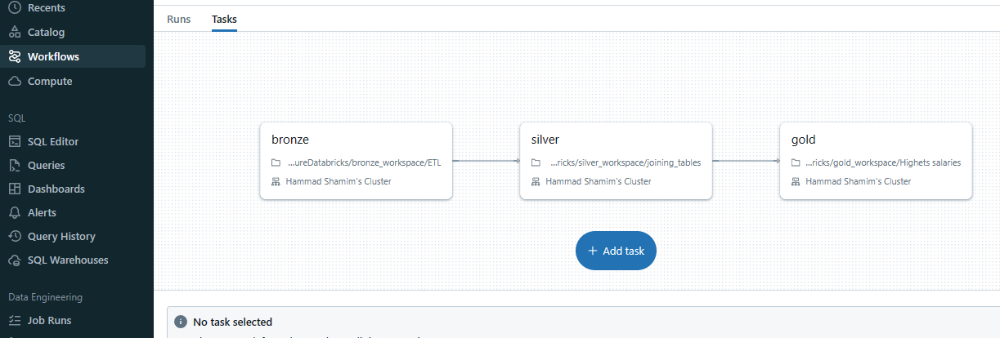

# Cloud Data Processing Pipeline

This repository contains code for two data pipelines designed to process and manage both file data and transactional data. The file data pipeline handles ingestion and transformation of data from parquet files, while the transactional data pipeline focuses on processing structured data typically stored in databases.

1. [Azure Databricks pipeline](#azure_data_pipeline).
2. [Transactional data to bigquery](#transactional-data-to-bigquery).
3. [File data to Bigquery](#file-data-to-bigquery).

## --> AZURE DATABRICKS PIPELINE <a id="azure_data_pipeline"></a>

This repository showcases a streamlined data pipeline built within Azure Databricks. Witness the journey:

🔗 Connect to Azure SQL Database and Data.

🥉 Load data into the Bronze.

🥈 Cleanse and join data in the Silver.

🥇 Calculate aggregations within the Gold catalog.

🚀 Seamlessly visualize insights in Power BI.

## Table of Contents

* [Overview](#azure-data-overview)
* [Components](#azure-data-components)
* [Usage](#azure-data-usage)
* [Pipeline Architecture](#azure-data-pipeline-architecture)
* [Youtube](#azure-youtube)

## Overview <a id="azure-data-overview"></a>

In this pipeline, we implement a Databricks Medallion architecture to integrate data from an Azure SQL database and Azure Data Lake.  Raw data is loaded into the Bronze zone, followed by filtering, joining, and cleansing in the Silver zone. Aggregations are computed in the Gold zone, ensuring data readiness for analysis. A scheduled Databricks job automates the ETL process, delivering consistent updates to the Gold zone. Finally, we connect Power BI to the Gold zone, enabling the creation of insightful dashboards for decision-makers.

## Components <a id="azure-data-components"></a>

* Databricks connector for securely connect databricks with storage account.
* Azure SQL database used as Transactional database.
* Azure Datalake and Databricks to built lakehouse architecture.
* PowerBi for visualization.

## Usage <a id="azure-data-usage"></a>

1. Create access connector for Azure Databricks in the same resource where you want to create your datalake connector .
2. Create your Storage account.
3. Create three containers inside your storage account 🥉Bronze 🥈Silver🥇Golde
4. Give Storage Blob Data Contributor role to your access connector which we create on step 1 .
5. In your Databricks catalog open External Data and create storage credential, you need to give connector Id of your azure databricks connector you can copy it from its overview inside ResourceID. .
6. After creating storage credential now we can create external location to fetch and load data from our containers. for this we need to create 3 external location bronze, silver, gold. . [Documentation to create external connection](https://learn.microsoft.com/en-us/azure/databricks/sql/language-manual/sql-ref-external-locations?source=recommendations) or alternatively you can use below script.

    ```SQL
    CREATE EXTERNAL LOCATION my_external_location_name 
    URL 'abfss://bronze@primarydata42.dfs.core.windows.net/'
    WITH (CREDENTIAL adb);
    ```

7. Create federated connection with your Azure SQL database for this go to external data then go to connections here you need to give your connection name connection type like sql server then test the connection and create it.
8. At this stage we have created all the external connection now we need to create catalog and schema for our connection so we can easily fetch or load data in them.
9. we need to create 4 catalogs bronze, silver, gold, my_transactional_data, for this we need to give catalog name its type and its external location which we already created in step6. . As external location already created it will give you hint when creating catalog.
10. After creating catalog we need to create schema main_tables and config_tables for each bronze, silver and gold.
11. For populating these schemas we need to make tables which store our data. To accomplish it we use DDL to create tables across each layer.
12. DDL use for main tables inside Bronze layer.

    ```SQL
    CREATE TABLE bronze.main_tables.employees
    (
      emp_no INT NOT NULL,
      birth_date DATE,
      first_name VARCHAR(255),
      last_name VARCHAR(255),
      gender CHAR(1),
      hire_date DATE,
      CONSTRAINT pk_employees PRIMARY KEY (emp_no)
    )
    USING DELTA
    PARTITIONED BY (hire_date);

    CREATE TABLE bronze.main_tables.departments
    (
      dept_no CHAR(4) NOT NULL,
      dept_name VARCHAR(255) NOT NULL,
      CONSTRAINT pk_department PRIMARY KEY (dept_no)
    )
    USING DELTA;

    CREATE TABLE bronze.main_tables.dept_manager (
    emp_no INT NOT NULL,
    dept_no CHAR(4) NOT NULL,
    from_date DATE NOT NULL,
    to_date DATE NOT NULL,
    CONSTRAINT FK_dept_manager_employees FOREIGN KEY (emp_no) REFERENCES bronze.main_tables.employees (emp_no) ,
    CONSTRAINT FK_dept_manager_departments FOREIGN KEY (dept_no) REFERENCES bronze.main_tables.departments (dept_no) ,
    CONSTRAINT PK_dept_manager PRIMARY KEY (emp_no, dept_no) 
    )
    USING DELTA;

    CREATE TABLE bronze.main_tables.dept_emp (
      emp_no      INT             NOT NULL,
      dept_no CHAR(4) NOT NULL,
      from_date   DATE            NOT NULL,
      to_date     DATE            NOT NULL,
      FOREIGN KEY (emp_no)  REFERENCES bronze.main_tables.employees,
      FOREIGN KEY (dept_no) REFERENCES bronze.main_tables.departments ,
      PRIMARY KEY (emp_no,dept_no)
    );

    CREATE TABLE bronze.main_tables.titles (
      emp_no      INT             NOT NULL,
      title       VARCHAR(50)     NOT NULL,
      from_date   DATE            NOT NULL,
      to_date     DATE,
      FOREIGN KEY (emp_no) REFERENCES bronze.main_tables.employees (emp_no) ,
      PRIMARY KEY (emp_no,title, from_date)
    )
    USING DELTA;

    CREATE TABLE bronze.main_tables.salaries (
        emp_no      INT             NOT NULL,
        salary      INT             NOT NULL,
        from_date   DATE            NOT NULL,
        to_date     DATE            NOT NULL,
        FOREIGN KEY (emp_no) REFERENCES bronze.main_tables.employees (emp_no),
        PRIMARY KEY (emp_no, from_date)
    ) 
    USING DELTA;
    ```

    Link .

13. DDL use for config tables inside Bronze layer.

      ```SQL
      CREATE TABLE bronze.config_tables.configurations(
        table_name VARCHAR(255),
        checkmark INT
      )
      USING DELTA;

      INSERT INTO bronze.config_tables.configurations(
        table_name ,
        checkmark
      )
      VALUES
      (
        'employees',0
      ),
      (
        'dept_emp',0
      ),
      (
        'dept_manager',0
      ),
      (
        'salaries',0
      ),
      (
        'titles',0
      )

      ```

    Link [Bronze DDL for config tables](./DDL/Azure/AzureDatabricks/Bronze/config/DDL_for_config_table.py).

14. DDL use for main tables inside Silver layer.

    ```SQL
    CREATE TABLE silver.main_table.joined_data
    (
      first_name VARCHAR(255) NOT NULL,
    last_name VARCHAR(255) NOT NULL,
    emp_no INT NOT NULL,
    dept_name VARCHAR(255) NOT NULL,
    from_date DATE NOT NULL,
    salary INT NOT NULL
    );
    ```

15. DDL use for main tables inside Gold layer.

    ```SQL

    CREATE TABLE gold.main_tables.average_salaries(
    dept_name VARCHAR(255) NOT NULL,
    salary FLOAT NOT NULL
    )
    USING DELTA

    ```

16. Now we created all of our tables in all layers. Its time to  populate them with data through ETL process. For this we need to design pipeline in such a way which fetches data from transactional database, load into bronze layer, after bronze data move to silver layer then silver to gold and finally in powerBI 
17. For creating a pipeline first we need to fetch data from transactional database to bronze zone. ["Loading data into bronze layer"](./src/pyspark_jobs/AzureDatabricks/bronze_workspace/ETL.py)

18. After populating bronze layer we load data into silver layer using sql script. ["Loading data into silver layer"](./src/pyspark_jobs/AzureDatabricks/silver_workspace/joining_tables.py).

19. We have clean and joined data in our silver zone now our task to aggregate our data, to accomplish it we created gold zone. ["Loading data into gold layer"](./src/pyspark_jobs/AzureDatabricks/gold_workspace/Highest_salaries.py).
20. After creating all the scripts our task is to run all these scipts on sequential manner at particuler timezone for this I orchestrate a pipeline in job runs. 
21. Now we have fully aggregated data ready our next task is to visualize this data for this we use powerBI.
22. For connecting with powerBI we need to Partner Connect and select Microsoft PowerBI it will download a connection file in your local directory. 
23. After designing your report you can publish it on powerBI service. 

## Pipeline Architecture <a id="azure-data-pipeline-architecture"></a>

  

## --> TRANSACTIONAL DATA TO BIGQUERY <a id="transactional-data-to-bigquery"></a>

This pipeline fetches data from the MySql transactional database after transformation it loads data into bigquery.

## Table of Contents

* [Overview](#transactional-data-overview)
* [Features](#transactional-data-features)
* [Components](#transactional-data-components)
* [Usage](#transactional-data-usage)
* [Pipeline Architecture](#transactional-data-pipeline-architecture)
* [Youtube](#youtube)

## Overview <a id="transactional-data-overview"></a>

In this pipeline we have transactional data which appended every hour, to load this data into warehouse we orchestrate a pipeline in apache airflow which create dataproc cluster and submits a pyspark job which fetches data from cloudSQL and after some transformation it loaded data into bigquery after the completion of this process dataproc cluster deleted to avoid undesired charges.

## Features <a id="transactional-data-features"></a>

* Fully automated scheduled pipeline.
* Creates DataProc cluster.
* Submits Pyspark job.
* Waits till job completed.
* Deleted the cluster after completion of job.
* Contains each and every file which use in this project.

## Components <a id="transactional-data-components"></a>

* CloudSQL(MySQL) instance which uses to store all transactional data.
* Compute Engine uses as Apache Airflow server.
* VPC Network used to provide connectivity between services.
* DataProc is used to process Pyspark jobs.
* BigQuery is used as a warehouse to store processed data.
* CloudStorage is used to store jar and pyspark files.

## Usage <a id="transactional-data-usage"></a>

1. Clone the repository.
2. Set up Google Cloud Platform (GCP) project.
3. Enable necessary APIs:  Google Cloud Dataproc,Google CloudSQL, Google Cloud Storage, Google BigQuery.
4. Allocate private IP range.
5. Run gcloud command to create CloudSQL instance

    ```bash
    gcloud sql instances create transactional-data --availability-type=zonal --authorized-networks 202.59.12.0/24 --database-version=MYSQL_8_0 --region=us-central1 --root-password=Karachi.321 --network default --edition=enterprise --cpu=2 --memory=8 --storage-type=SSD --storage-size=10 
    ```

6. Run DDL statements to create database and table schema in bigquery.

    ```SQL
    CREATE SCHEMA planes;
    CREATE TABLE planes.planes
    ( 
      pri_key int ,
      tailnum STRING,
      year INT64,
      type STRING,
      manufacturer STRING,
      model STRING,
      engines INT64,
      seats INT64,
      speed STRING,
      engine STRING
    );

    CREATE TABLE planes.config_table
    (
      check_mark int,
      config_data STRING
    );

    ```

7. Create cloudstorage bucket with globally unique name and after creation create two folder
    -jars
    -pyspark_files
8. insert config data into bigquery table `planes.config_table` using DML statement. Change this configuration according to your details.

      ```SQL
    insert into planes.config_table
    (
      check_mark,
      config_data
    )
    values(
      0,
      '{"jdbc_hostname": "10.27.144.3", "jdbc_port": 3306,"database":"planes","username":"root","password":"Karachi.321","table_":"planes","bucket":"databb_bucket789"}'
    )
      ```

9. upload JAR files to jar folder 
      * [gcs-connector-hadoop2-2.1.1.jar](jars/gcs-connector-hadoop2-2.1.1.jar)
      * [mysql-connector-java-8.0.13.jar](jars/mysql-connector-java-8.0.13.jar)
      * [protobuf-java-3.6.1.jar](jars/protobuf-java-3.6.1.jar)
      * [spark-2.4-bigquery-0.36.1.jar](jars/spark-2.4-bigquery-0.36.1.jar)
      * [spark-3.5-bigquery-0.36.1.jar](jars/spark-3.5-bigquery-0.36.1.jar)

10. If your cloudSQL instance created then connect it with any mysql instance like Azure data studio. Use your instance external IP to connect.
    
11. Run DDL statements to create cloudsql database and table.

    ```SQL
    CREATE DATABASE planes;

    use planes;

    CREATE TABLE planes
    (   
        pri_key int PRIMARY KEY,
        tailnum varchar(255) NOT NULL ,
        year SMALLINT,
        type varchar(255),
        manufacturer varchar(255),
        model varchar(255),	
        engines SMALLINT,	
        seats SMALLINT,	
        speed varchar(255),	
        engine VARCHAR(255)

    );
    ```

12. Insert dummy data on your transactional database using [inserting_script_file_to_database.py](src/extras/inserting_script_file_to_database.py).
13. Create compute engine instance for Apache Airflow using below script. Must change your poroject name and service account number from below script.

      ```BASH
      gcloud compute instances create my-instance --project=playground-s-11-806f63b2 --zone=us-central1-a --machine-type=e2-custom-2-8192 --network-interface=network-tier=PREMIUM,stack-type=IPV4_ONLY,subnet=default --maintenance-policy=MIGRATE --provisioning-model=STANDARD --service-account=768546597619-compute@developer.gserviceaccount.com --scopes=https://www.googleapis.com/auth/cloud-platform --tags=http-server,https-server --create-disk=auto-delete=yes,boot=yes,device-name=my-instance,image=projects/debian-cloud/global/images/debian-12-bookworm-v20240213,mode=rw,size=20,type=projects/playground-s-11-806f63b2/zones/us-central1-a/diskTypes/pd-balanced --no-shielded-secure-boot --shielded-vtpm --shielded-integrity-monitoring --labels=goog-ec-src=vm_add-gcloud --reservation-affinity=any
    ```

14. Create firewall rule to access airflow webserver from your local instance.

      ```BASH
      gcloud compute --project=playground-s-11-806f63b2 firewall-rules create airflow --direction=INGRESS --priority=1000 --network=default --action=ALLOW --rules=tcp:8080 --source-ranges=202.59.12.0/24

      ```

15. Install airflow using below scripts on your compute engine instance.

    ```BASH
      sudo apt install python3.11-venv
      python3 -m venv airflow_env
      source airflow_env/bin/activate
      pip install apache-airflow[gcp]
      airflow db init
      airflow users create --username root --password Karachi.321 --role Admin --firstname hams --lastname 42 --email abc@gmail.com
      airflow webserver -p 8080 
      airflow scheduler
      cd airflow
      mkdir dags

    ```

16. Set environment variable in airflow using [variables.json](scripts/transactional_data/apache_airflow/variables.json)
  
17. Copy dags from your local directory to compute engine directory inside `dags` folder.

    ```BASH
    gcloud compute scp "E:\workspace\Orchestrate ETL pipeline\mysql-pandas\dags\pipeline.py" my-instance:/home/hamma/airflow/dags

    ```

18. Triggers a dag manually or schedule it to trigger automatically.

19. After successful completion you will see your transformed data into bigquery.

## Pipeline Architecture <a id="transactional-data-pipeline-architecture"></a>

## --> FILE DATA TO BIGQUERY <a id="file-data-to-bigquery"></a>

Reads data from parquet file and load data into bigquery.

## Table of Contents 

* [Overview](#file-data-overview)
* [Features](#file-data-features)
* [Components](#file-data-components)
* [Usage](#file-data-usage)
* [Pipeline Architecture](#file-data-pipeline-architecture)
* [Youtube](#file_data_bigquery)

## Overview <a id="file-data-overview"></a>

The Cloud Data Processing Pipeline automates the processing of data files stored in a cloud storage bucket using Google Cloud Platform services. The pipeline is orchestrated by Google Cloud Composer and utilizes Google Cloud Dataproc, PySpark, Google BigQuery, and Google Cloud Storage.

## Features <a id="file-data-features"></a>

* Automatically processes data files stored in a cloud storage bucket.
* Orchestrates a PySpark cluster on Google Cloud Dataproc.
* Executes PySpark jobs to extract and transform data.
* Loads processed data into Google BigQuery.
* Moves processed files to a designated zone within the cloud storage bucket.
* Cleans up the Dataproc cluster after processing.

## Components <a id="file-data-components"></a>

**Google Cloud Storage (GCS)**: Stores the input and output data files.
**Google Cloud Composer**: Orchestrates the pipeline workflow.
**Google Cloud Dataproc**: Manages the PySpark cluster for data processing.
**PySpark**: Performs data extraction and transformation tasks.
**Google BigQuery**: Stores the processed data.

## Usage <a id="file-data-usage"></a>

1. Clone the repository.
2. Set up Google Cloud Platform (GCP) project.
3. Enable necessary APIs: Google Cloud Composer, Google Cloud Dataproc, Google Cloud Storage, Google BigQuery.
4. Set up a service account with appropriate permissions for GCP services.
5. Configure the pipeline parameters and environment variables.
6. Upload data files to the designated processing zone in GCS.
7. Trigger the pipeline execution in Cloud Composer.
8. Monitor the pipeline progress and logs in Cloud Composer.
9. Verify the data loading and processing results in BigQuery.
10. Clean up resources after processing.

## Pipeline Architecture <a id="file-data-pipeline-architecture"></a>

1. Dataproc Cluster Creation: Airflow creates a Dataproc cluster in GCP.
2. PySpark Job Submission: Airflow submits a PySpark job to the Dataproc cluster.
3. Data Processing and Loading:
  The PySpark job does the following:
  Fetches Parquet files from Cloud Storage ('processing_zone').
  Performs necessary data transformations.
  Loads the processed data into a BigQuery table.
  Moves processed files to a 'processed_zone'.
4. Cluster Deletion: Airflow deletes the Dataproc cluster.


## Youtube <a id="file_data_bigquery"></a>

[Orchestrating pipeline in airflow](https://youtu.be/rbjTeWTMnPs)

## Contributors

[Hammad Shamim](https://www.linkedin.com/in/hammad-shamim-6a2344128/)

## License

This project is licensed under the [MIT License](LICENSE).

Feel free to customize this README.md according to your project's specific details and requirements. Good luck with your Cloud Data Processing Pipeline project!
